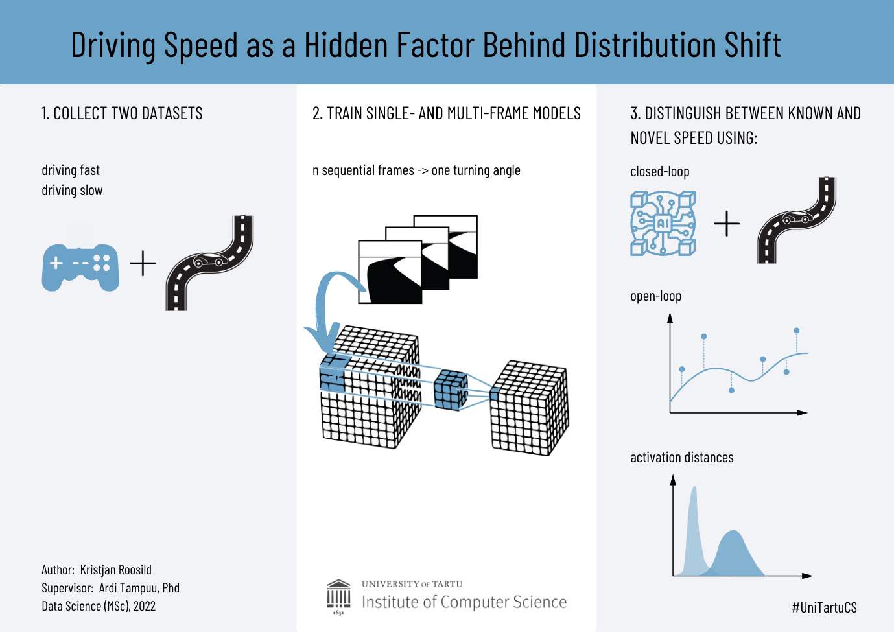

# Driving Speed as a Hidden Factor Behind Distribution Shift
Tartu University 2022, Msc

## Project setup
This repo contains submodule, so do git clone recursively:

`git clone --recursive https://github.com/kristjanr/dat-sci-master-thesis.git`

Install deps for submodule (OSX):

`conda env create -f donkeycar/install/envs/mac.yml` (this may take up to 5 minutes)

`conda activate donkey`

`pip install -e donkeycar/.`

Install deps for this project

`conda install -c conda-forge jupyterlab ipykernel scikit-learn nbformat=4.4.0`

`ipython kernel install --user --name=donkey`

`jupyter lab`

## Getting models and predictions for open-loop analysis

The [PredictAndSave](https://github.com/kristjanr/dat-sci-master-thesis/blob/master/PredictAndSave.ipynb) notebook downloads data and models. Then it runs the inference, saving the results into a file.
The resulting files are already in this repository, in the [open-loop-results](https://github.com/kristjanr/dat-sci-master-thesis/tree/master/open-loop-results) folder.

